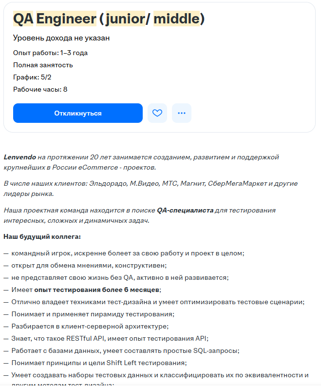
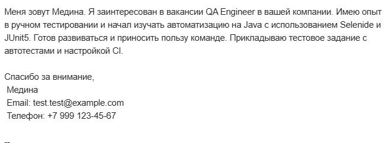

#  Автотесты для формы регистрации (DemoQA)

##  Вакансия
QA Engineer (Junior / Middle)  
[Ссылка на вакансию](https://hh.ru/vacancy/119445881?query=QA+Engineer+%28Junior+%2F+Middle%29&hhtmFrom=vacancy_search_list)

Скриншот вакансии:  


---

##  Сопроводительное письмо

Скриншот письма, отправленного рекрутеру:  


---

##  Что реализовано

- 🔹 3 автотеста на [demoqa.com/automation-practice-form](https://demoqa.com/automation-practice-form)
- 🔹 Allure-отчёт 
- 🔹 Запуск тестов в **Selenoid** (Chrome)
- 🔹 Интеграция с **Jenkins** [https://jenkins.autotests.cloud/job/demoqa-HW-3](https://jenkins.autotests.cloud/job/demoqa-HW-3/53/allure/)
- 🔹 Уведомления в **Telegram**

---

##  Как запускать

###  Локально

```bash
./gradlew clean test
./gradlew allureReport
